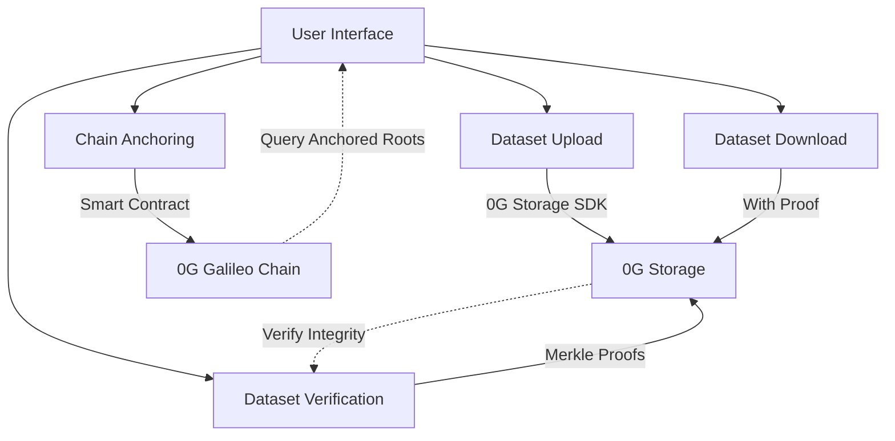

#⚡ DARA Forge: Decentralized AI Research Assistant

---

## 🚀 Project Overview

DARA Forge revolutionizes scientific research by providing a decentralized platform for storing, verifying, and sharing research datasets with cryptographic integrity guarantees. Built on 0G's modular blockchain infrastructure, DARA Forge ensures that research data remains tamper-proof, verifiable, and permanently accessible.

---

## 🎯 Key Problems Solved

- **Data Integrity**: Research data can be cryptographically verified against tampering
- **Transparent Provenance**: Clear lineage of dataset origins and modifications
- **Permanent Record**: Dataset proofs anchored on-chain for immutable references
- **Open Science**: Promotes reproducibility and verification in scientific research

---

## ⚡ Live Demo

👉 [Experience DARA Forge](https://dara-forge.vercel.app)

---

## 🔍 Core Features

| Feature                      | Description                                                |
| ---------------------------- | ---------------------------------------------------------- |
| **0G Integration**           | Secure dataset upload with cryptographic guarantees        |
| **Merkle Root Verification** | Verify dataset integrity using cryptographic Merkle proofs |
| **On-Chain Anchoring**       | Permanently commit dataset proofs to the blockchain        |
| **Proof-Based Downloads**    | Download datasets with cryptographic proof of integrity    |
| **Propagation Verification** | Ensure dataset availability across the 0G network          |

---

## 🔧 Technical Implementation

### How DARA Forge Integrates with 0G Stack



### 0G Storage Integration

```typescript
// Upload files to 0G Storage with Merkle root generation.
const uploadResponse = await 0gSdk.storage.uploadDirectory(files, {
  token: process.env.OG_API_KEY
});

// Verify uploaded data integrity
const verifyResponse = await 0gSdk.storage.verify(root, {
  token: process.env.OG_API_KEY
});

// Download files with cryptographic proof
const downloadResponse = await 0gSdk.storage.downloadWithProof(root, filePath, {
  token: process.env.OG_API_KEY
});
```

### 0G Chain Integration

```typescript
// Connect to 0G Galileo testnet
const provider = new ethers.BrowserProvider(window.ethereum);
const signer = await provider.getSigner();

// Log dataset root to 0G Chain using DaraLogger contract
const contract = new ethers.Contract(CONTRACT_ADDRESS, DARA_ABI, signer);
const tx = await contract.logData(datasetRoot);
const receipt = await tx.wait();

console.log(`Dataset logged on 0G Chain: ${receipt.hash}`);
```

---

## 📊 0G Galileo Testnet Details

| Parameter         | Value                                                              |
| ----------------- | ------------------------------------------------------------------ |
| Network Name      | Galileo (Testnet)                                                  |
| Chain ID          | 16602                                                              |
| RPC URL           | [https://evmrpc-testnet.0g.ai](https://evmrpc-testnet.0g.ai)       |
| Block Explorer    | [https://chainscan-galileo.0g.ai](https://chainscan-galileo.0g.ai) |
| Currency Symbol   | 0G                                                                 |
| Currency Decimals | 18                                                                 |

---

## 💻 Getting Started

### Prerequisites

- Node.js (v18 or later)
- MetaMask wallet extension
- 0G Galileo testnet configured in MetaMask

### Local Development

```bash
# Clone the repository
git clone https://github.com/mohamedwael201193/dara-forge.git

# Navigate to project directory
cd dara-forge

# Install dependencies
npm install

# Start development server
npm run dev
```

### Setting Up MetaMask for 0G Galileo

1. Open MetaMask and go to **Networks**
2. Click **Add Network**
3. Enter the following details:

```
Network Name: Galileo (Testnet)
RPC URL: https://evmrpc-testnet.0g.ai
Chain ID: 16602
Currency Symbol: 0G
Block Explorer URL: https://chainscan-galileo.0g.ai
```

---

## 🧪 How It Works

1. **Upload Dataset** → Researchers upload datasets to 0G Storage
2. **Generate Merkle Root** → The system computes a cryptographic root
3. **Verify Integrity** → Dataset integrity is verified via Merkle proofs
4. **Anchor On-Chain** → Dataset root is permanently committed to 0G Chain
5. **Download with Proof** → Anyone can download with cryptographic proof

---

## 🔜 Roadmap

### Wave 1 (Current)

- ✅ 0G Storage integration
- ✅ Merkle root verification
- ✅ 0G Chain anchoring
- ✅ Basic MetaMask wallet connection
- ✅ User-friendly interface
- ✅ Multi-wallet support
- ✅ SIWE authentication
- ✅ Real-time Balance Display

### Wave 2 (Completed)

- ✅ Dataset search & discovery
- ✅ Researcher profiles
- ✅ Enhanced metadata support
- ✅ Versioning, batch uploads, rich metadata (as groundwork for collaborative research ecosystem)
- ✅ Smart contract-enabled role-based project management (as groundwork for collaborative research ecosystem)

### Wave 3 (Future)

- 🔲 0G Compute integration
- 🔲 Collaborative research spaces
- 🔲 Advanced analytics visualization
- 🔲 Cross-chain dataset verification
- 🔲 Academic publishing workflows

---

## 💡 Innovation Highlights

- **Cryptographic Verification** via Merkle trees
- **On-chain Provenance** for permanent dataset history
- **Verifiable Downloads** to ensure data consistency
- **Decentralized Storage** resistant to censorship
- **Research-First Design** optimized for scientists

---

## 👨‍💻 Technologies Used

- **Frontend**: React, TypeScript, Tailwind CSS, shadcn/ui
- **Blockchain**: ethers.js, MetaMask
- **Build Tools**: Vite, PostCSS
- **0G Integration**: 0G SDK, 0G Storage API, 0G Chain

---

## 🔗 Important Links

- [Live Demo](https://dara-forge.vercel.app)
- [GitHub Repository](https://github.com/mohamedwael201193/dara-forge)
- [0G Documentation](https://docs.0g.ai)
- [WaveHack Details](https://app.akindo.io/wave-hacks)

---

## 👥 Developer

- **Mohamed Wael**

  - GitHub: [@mohamedwael201193](https://github.com/mohamedwael201193)
  - Twitter: [@Mowael777](https://twitter.com/Mowael777)
  - Telegram: [@Mowael77](https://t.me/Mowael77)

---

## 📜 License

This project is licensed under the **MIT License** - see the LICENSE file for details.

### Environment Variables

To enable 0G Compute functionality, the following environment variables are required:

- `OG_RPC_URL`: RPC URL for the 0G network.
- `OG_COMPUTE_PRIVATE_KEY`: Private key for the wallet used by the compute service.
- `OG_MIN_LEDGER_BALANCE` (Optional): Minimum ledger balance required (default: 0.01).
- `OG_BOOTSTRAP_LEDGER` (Optional): Initial ledger amount to add if balance is zero (default: 0.05).
- `OG_REFILL_AMOUNT` (Optional): Amount to refill the ledger if balance falls below minimum (default: 0.05).

These variables should be set in your Vercel project settings or in a `.env.local` file for local development.

## 🚀 Updates in Wave 2

🚀 **DARA Forge Wave 2: From Vision to Verified Reality on 0G**

We've achieved a significant breakthrough with DARA now LIVE, featuring robust integration with 0G Storage. This enables the processing of real research data with cryptographic verification, ensuring data integrity and trustworthiness. Our focus for Wave 2 has been on expanding DARA into a truly collaborative research ecosystem.

**Key Updates & Deliverables:**

- **Full 0G Storage Integration:** Implemented comprehensive 0G Storage capabilities, allowing for secure and verifiable storage of research datasets. This includes handling of file uploads, generation of root hashes, and tracking of storage transactions, all verifiable on the 0G Storage Explorer (e.g., [https://storagescan-galileo.0g.ai/history](https://storagescan-galileo.0g.ai/history)).

- **Enhanced Wallet Integration & Authentication:** We've significantly improved user accessibility and security by integrating multi-wallet support. Users can now seamlessly connect their wallets via Reown, WalletConnect, Coinbase, and SIWE (Sign-In with Ethereum). This provides a flexible and secure authentication mechanism for researchers.

- **Real-time Balance Display:** The application now prominently displays wallet balances, offering users immediate visibility into their assets and facilitating smoother interactions within the DARA ecosystem.

- **Collaborative Research Ecosystem Foundation:** By focusing on robust 0G Storage and advanced authentication, DARA is evolving beyond a data verification tool into a platform that fosters collaboration. This wave lays the groundwork for future features like versioning, batch uploads, rich metadata, and smart contract-enabled role-based project management.

**Vision for the Future:**

By the end of Wave 2, DARA has transformed into a collaborative research ecosystem powered by 0G, setting the stage for deeper integration with 0G Compute and 0G DA in subsequent waves. Our aim is to provide a definitive, trustless infrastructure for reproducible science, ensuring that every piece of research data is verifiable, secure, and accessible.
